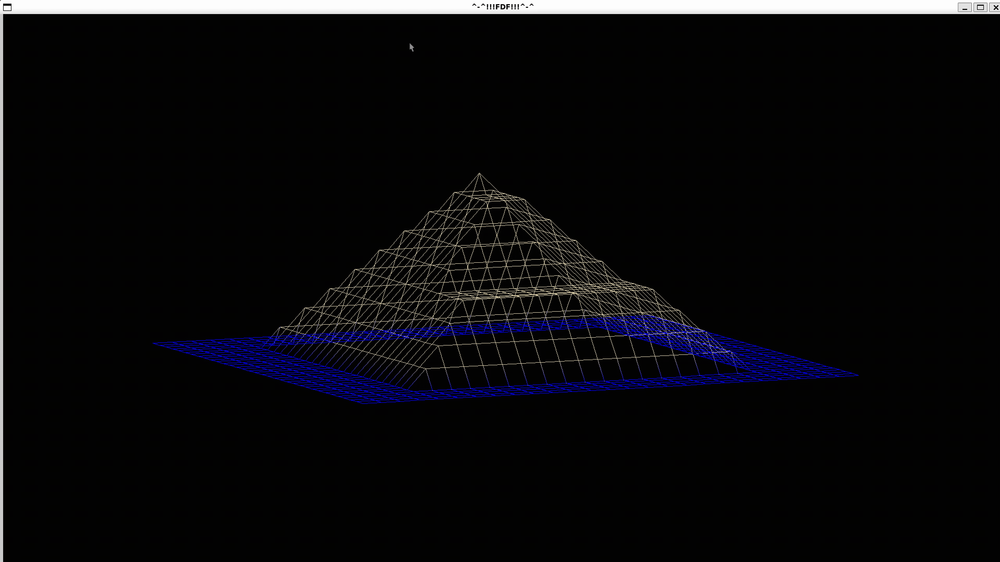

<h1 align="center">FDF - Wireframe 3D Viewer</h1>

A 3D wireframe visualization program that transforms 2D heightmaps into beautiful 3D projections using isometric and orthographic rendering.

<h2 align="center">🎥 Demo</h2>

  
   
  
  

<h2>📌 Table of Contents</h2>
<ul>
  <li><a href="#about">About</a></li>
  <li><a href="#features">Features</a></li>
  <li><a href="#installation">Installation</a></li>
  <li><a href="#usage">Usage</a></li>
  <li><a href="#controls">Controls</a></li>
  <li><a href="#map-format">Map Format</a></li>
  <li><a href="#project-structure">Project Structure</a></li>
  <li><a href="#git-setup">Git Setup</a></li>
  <li><a href="#contributing">Contributing</a></li>
  <li><a href="#license">License</a></li>
</ul>

<h2 id="about">📖 About</h2>

FDF (<em>Fil de Fer</em>, French for "wireframe") is a graphics project that creates 3D wireframe representations of 2D heightmaps.
The program reads map files containing elevation data and renders them as interactive 3D visualizations using the MinilibX graphics library.

This project demonstrates:

<ul>
  <li>3D mathematics and transformations</li>
  <li>Isometric and orthographic projections</li>
  <li>Line drawing algorithms (Bresenham's)</li>
  <li>Color interpolation and gradients</li>
  <li>Event handling and user interaction</li>
</ul>

<h2 id="features">✨ Features</h2>
<ul>
  <li><strong>Multiple Projection Modes</strong>: Isometric and orthographic views</li>
  <li><strong>Interactive Controls</strong>: Rotate, scale, translate wireframes in real time</li>
  <li><strong>Color Support</strong>: Heightmaps with smooth color gradients</li>
  <li><strong>Smooth Rendering</strong>: Optimized lines and anti-aliasing</li>
  <li><strong>Dynamic Transformations</strong>: Real-time model manipulation</li>
  <li><strong>Multiple Map Support</strong>: Compatible with various heightmap formats</li>
</ul>

<h2 id="installation">⚙️ Installation</h2>

<h3>Quick Setup</h3>

Use the provided installation script to automatically install all dependencies:

<pre><code class="bash">./config.sh
</code></pre>

This script will:

<ul>
  <li>Update your system packages</li>
  <li>Install build tools (GCC, Make)</li>
  <li>Install X11 development libraries</li>
  <li>Clone and set up the MinilibX library</li>
</ul>

<h3>Manual Compilation</h3>
<pre><code>
# Compile the project
make

# Compile with bonus features
make bonus

# Clean build files
make clean

# Remove all generated files
make fclean

# Rebuild everything
make re
</code></pre>

<h2 id="controls">🎮 Controls</h2>

<h3>🧠 Keyboard Controls</h3>
<ul>
  <li><strong>ESC</strong>: Exit program  </li>
  <li><strong>Arrow Keys</strong>: Move/translate the wireframe  </li>
  <li><strong>I </strong>: Zoom in  </li>
  <li><strong>O </strong>: Zoom out  </li>
  <li><strong>Q / E</strong>: Rotate Y-axis  </li>
  <li><strong>W / S</strong>: Rotate X-axis  </li>
  <li><strong>A / D</strong>: Rotate Z-axis  </li>
</ul>

<h3>🖱️ Mouse Controls</h3>
<ul>
  <li><strong>Scroll Up</strong>: Zoom in  </li>
  <li><strong>Scroll Down</strong>: Zoom out  </li>
</ul>

<h2 id="map-format">🗺️ Map Format</h2>

FDF accepts heightmap files like this:

<pre><code>0 0 0 0 0 0 0 0 0 0 0 0 0 0 0 0 0 0 0
0 0 0 0 0 0 0 0 0 0 0 0 0 0 0 0 0 0 0
0 0 10 10 0 0 10 10 0 0 0 10 10 10 10 10 0 0 0
0 0 10 10 0 0 10 10 0 0 0 0 0 0 0 10 10 0 0
0 0 10 10 0 0 10 10 0 0 0 0 0 0 0 10 10 0 0
0 0 10 10 10 10 10 10 0 0 0 0 10 10 10 10 0 0 0
0 0 0 10 10 10 10 10 0 0 0 10 10 0 0 0 0 0 0
0 0 0 0 0 0 10 10 0 0 0 10 10 0 0 0 0 0 0
0 0 0 0 0 0 10 10 0 0 0 10 10 10 10 10 10 0 0
0 0 0 0 0 0 0 0 0 0 0 0 0 0 0 0 0 0 0
</code></pre>

<strong>With Colors:</strong> You can add hexadecimal color codes like this:

<pre><code>0 0 0,0xFFFFFF 0 0
0 0 10,0xFF0000 10 0 0
0 0 10 10 0 0
</code></pre>

<strong>Made by CF Leung</strong>

<em>Last updated: July 2025</em>
